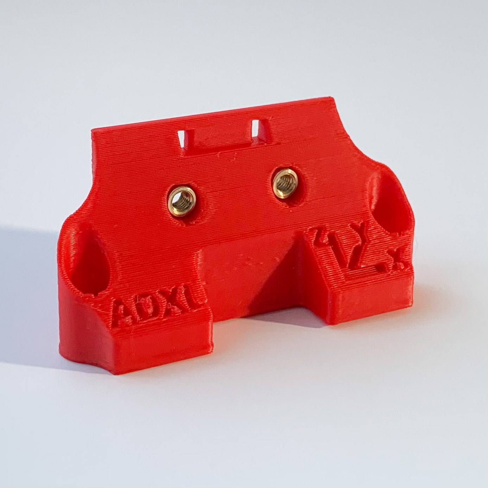
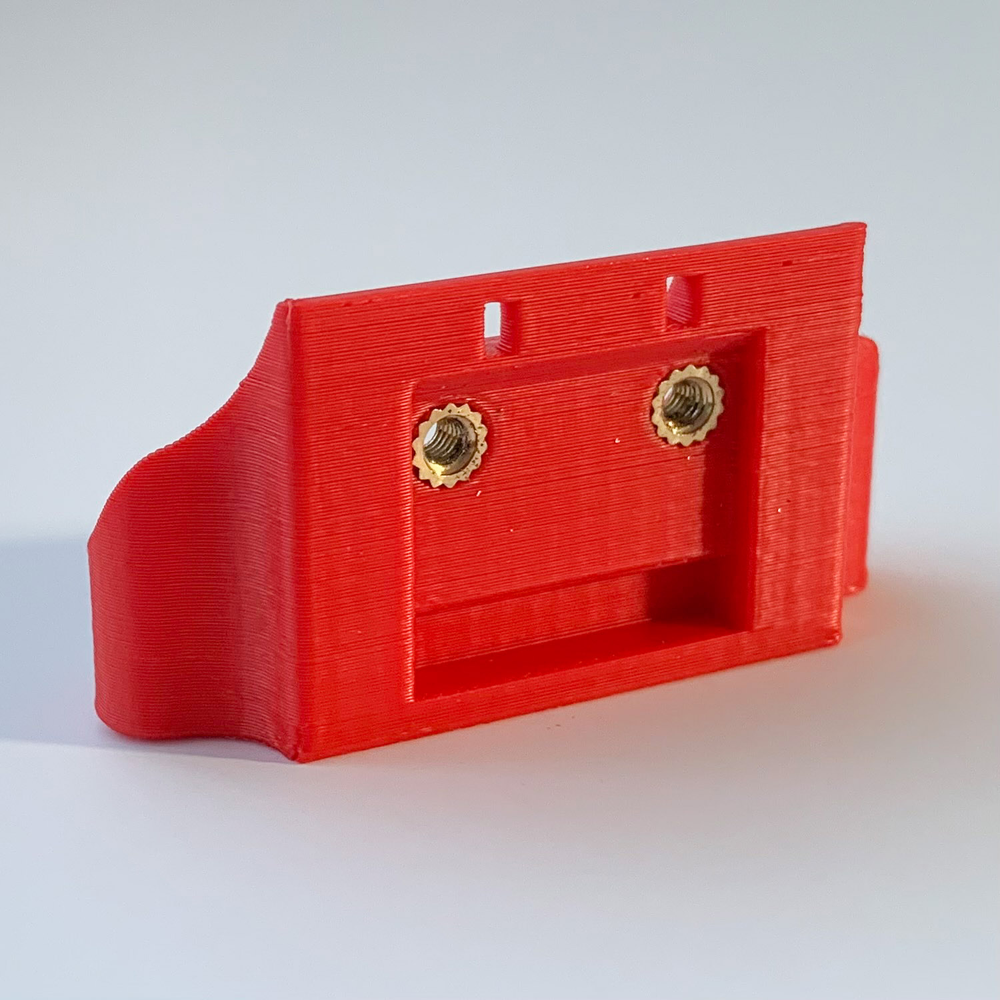
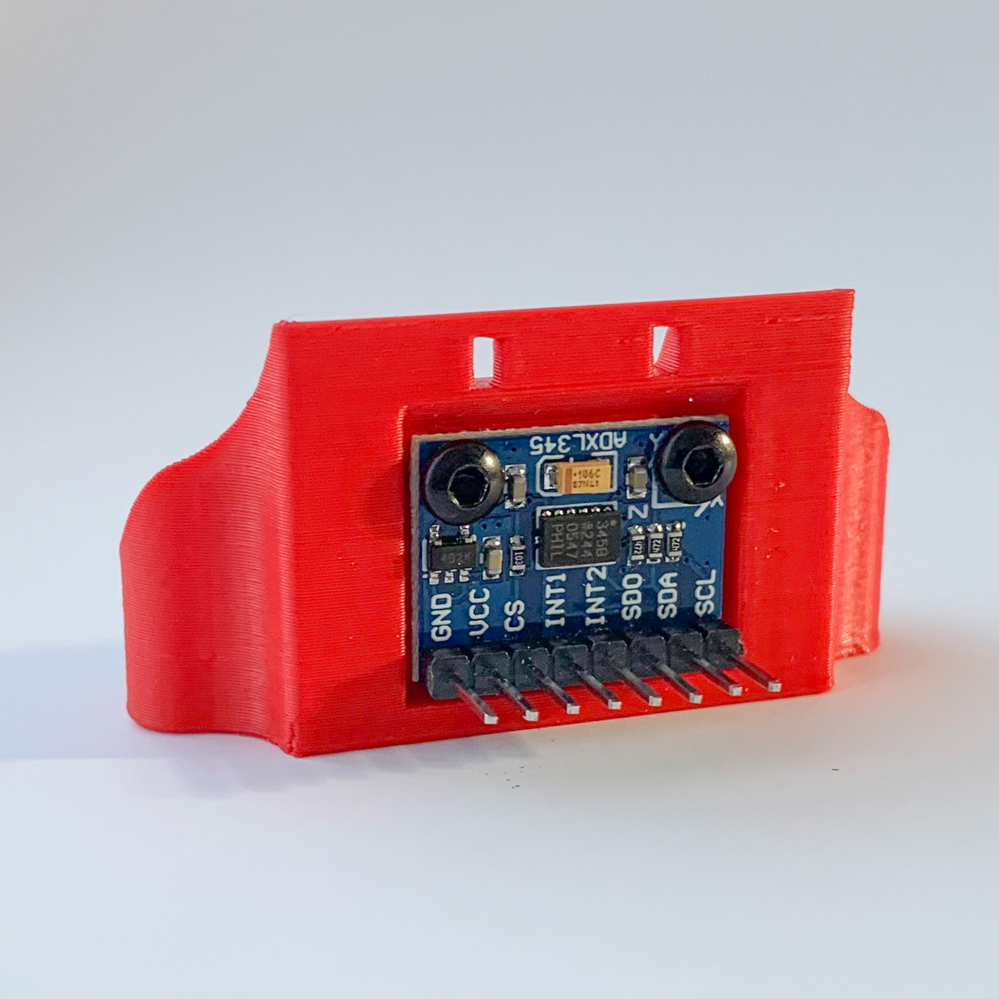
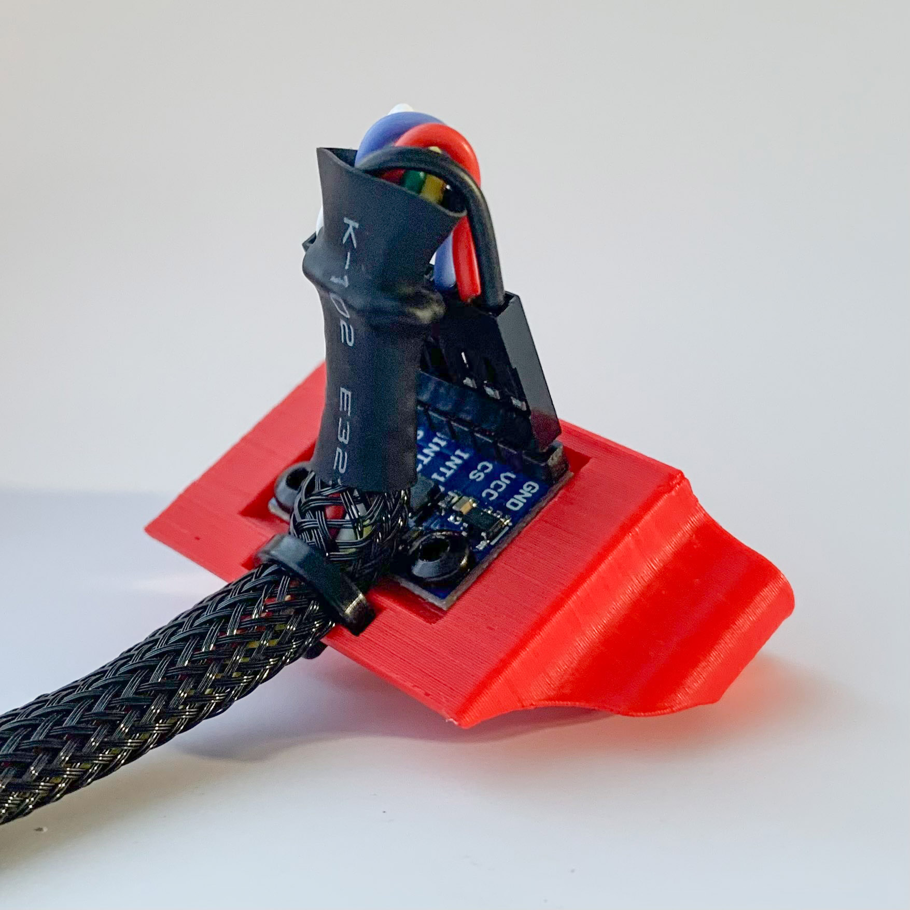
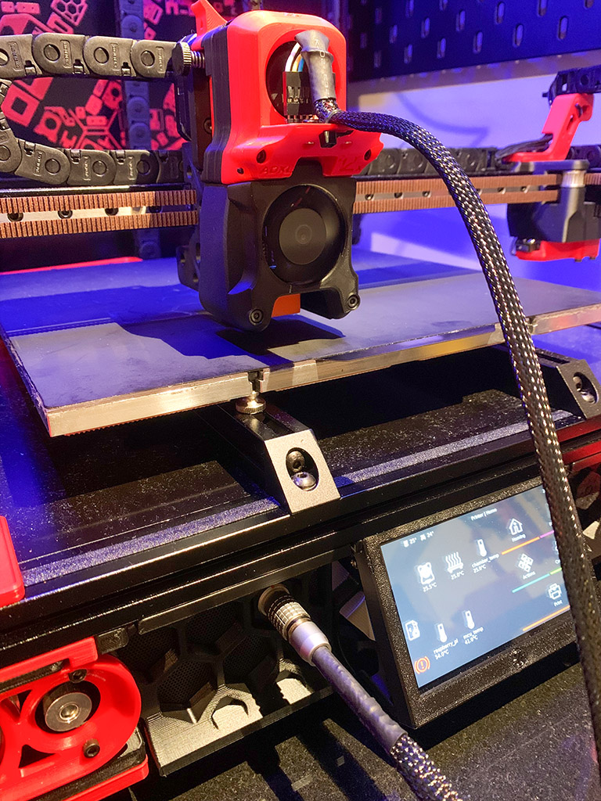

# Adxl mount mod
## Credit
This mod is based on the mod of
* 3DP MAMSIH
* Th3FalleN
* shared in voronuser_mods channel in discord: https://discord.com/channels/460117602945990666/635687829254701107/849006095430844427 or https://discord.com/channels/460117602945990666/635687829254701107/849035515802288158

Thank you for your awesome work!
## Print settings
As stated in the Voron documentation:
* ABS
* 0.2mm layer hight
* 0.4mm extrusion width
* 40% infill
* wall count 4
* top/bottom layers 5
* no supports
## Bom
* 2x heat insert m3
* 2mm wide zip-tie
## Improvement
Added a cable strain-relief
## Description
I really liked the adxl mount posted in the voronuser_mods channel by 3DP MAMSIH. Thanks to Th3FalleN it was modified to have  heat-set inserts. I added the possibility to fix the cable to the mount, so it does not need to hang directly from the adxl pin headers.

## Pictures

