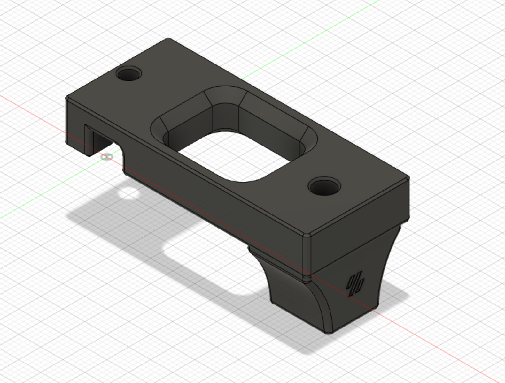

# Vertical bowden mount and zip tie bowden mount
## Credit
Mod based on the design of the Voron crew.
Thank you for your awesome work!
## Print settings
As stated in the Voron documentation:
* ABS
* 0.2mm layer hight
* 0.4mm extrusion width
* 40% infill
* wall count 4
* top/bottom layers 5
* no supports

## Bom
### Vertical bowden mount
* printed part
* pneumatic coupler pc4-m10

### Zip tie bowden mount
* printed part
* up to 4mm wide zip tie

## Improvement
### Vertical bowden mount
* Opening of the reverse bowden is facing upwards. Nice for filament spools that are placed above the printer.

### Zip tie bowden mount
* Allows to secure also braided bowden tubes.

## Description
### Vertical bowden mount
I have my spools on a shelve above the printer. So i wanted the reverse bowden tube to face upwards, not sideways. The pneumatic coupler holds the bowden tube in place and allows for easy removal. It can be screwed right into the plastic part.
### Zip tie bowden mount
I have braided my reverse bowden for nicer looks. To guide it securely to the rear entry point into the housing, I changed the standard bowden tube holder a bit, so the bowden tube can be secured by a zip tie instead of having to push it through the holder.

## Pictures
### Vertical bowden mount

&nbsp; 

### Zip tie bowden mount

&nbsp; 

&nbsp; 

