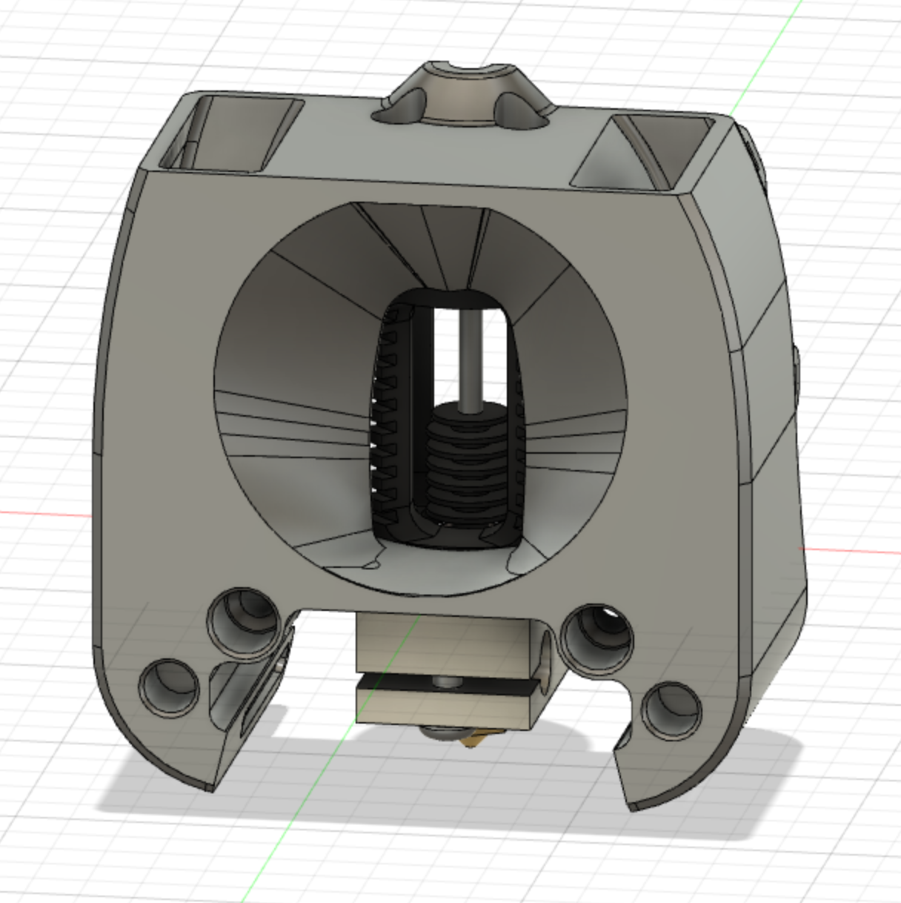
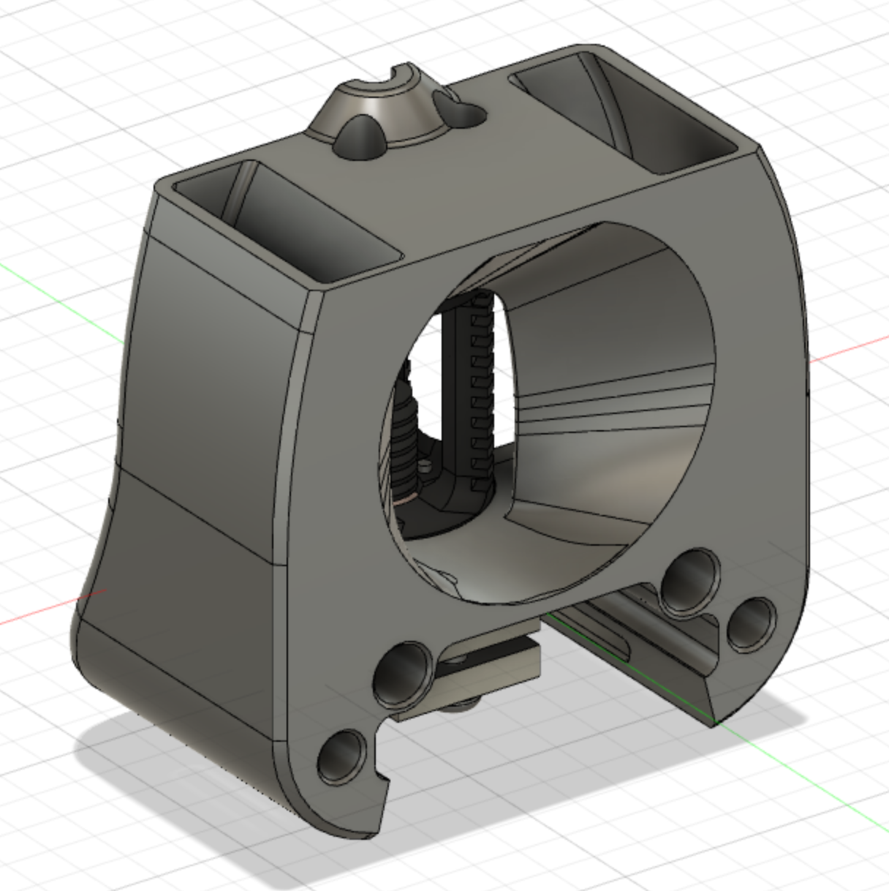

# Optimized airflow for dragon hotend printhead front mod
## Status
Work in progress...
## Credits
The Voron team for the original design of the printhead.
Thank you guys for your awesome work!
## Print settings
As stated in the Voron documentation:
* ABS
* 0.2mm layer hight
* 0.4mm extrusion width
* 40% infill
* wall count 4
* top/bottom layers 5
* no supports
## Bom
Nothing extra compared to the normal build. Just print the file.
## Description
With the normal dragon front printhead design of the afterburner a lot of the airflow is not used to cool the heat break. It has the possibility to flow on the left and right side without touching the heat sink.  
With this mod I wanted to restrict the airflow in a way that most of the air has to pass the heat sink, hence cooling the heatsink more.  
I also wanted to keep the additional weight down as much as possible.

