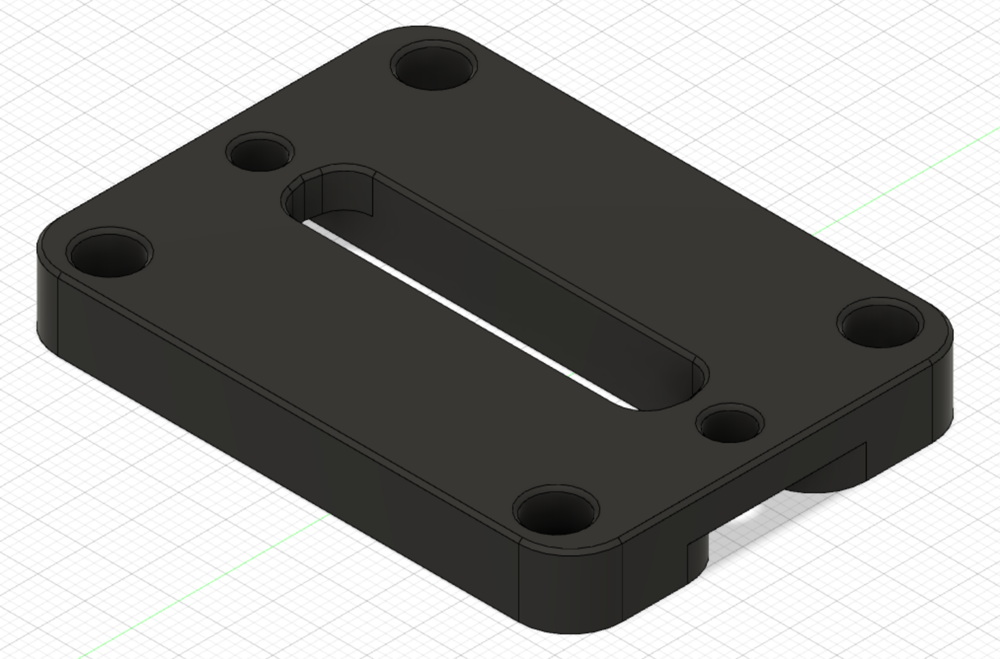
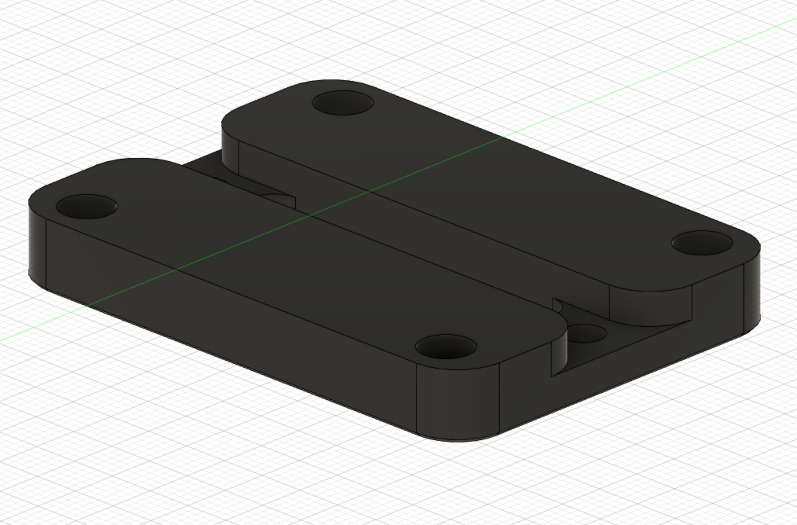
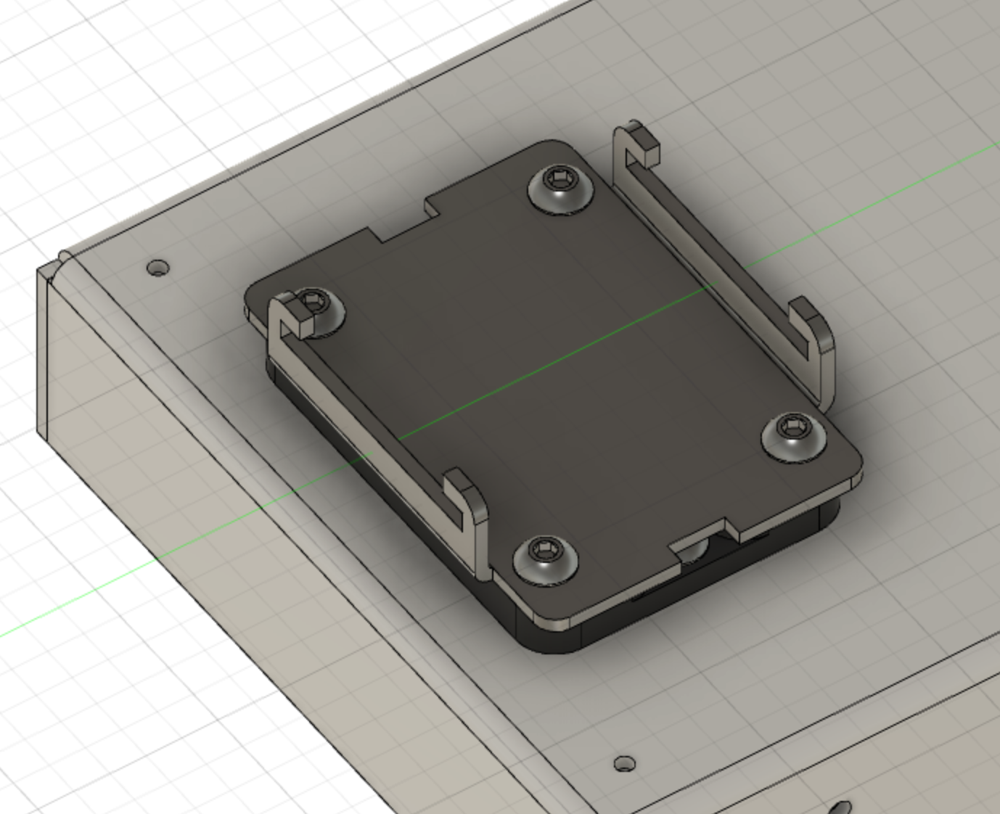
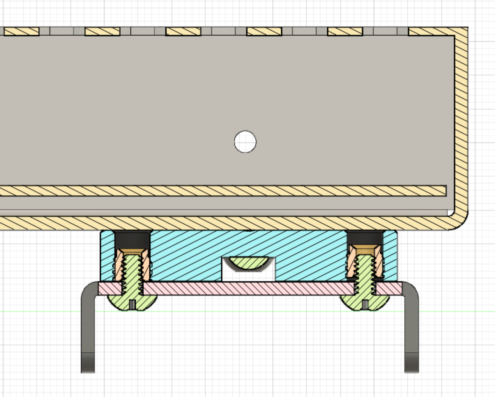

# SSR Din clip adapter for Meanwell psu
## Credit
Design by me.
## Print settings
As stated in the Voron documentation:
* ABS
* 0.2mm layer hight
* 0.4mm extrusion width
* 40% infill
* wall count 4
* top/bottom layers 5
* no supports
## Bom
* 4x heat set insert m4 (length 6.3mm/outer diameter max 6.3mm/outer diameter min 5.5mm)
* 4x m4 screws
* SSR DIN Clip (e.g. https://vonwange.com/product/ssr-din-clip/)
## Description
I wanted to mount my psu more rigid to the din rail and found that two SSR Din clips would work great. The adapter is mounted directly on the Mean Well LRS-200-24 PSU on one side with two screws (middle two screws) and with 4 screws to the SSR Din clip. It its thickness allows that the SSR Din clip can be reached with fingers for easy mounting on the din rail. At least for me ;)

