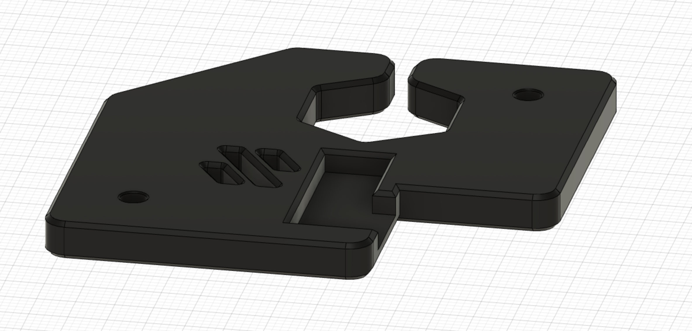

# z belt cover mod
## Credit
The Voron crew.
Thank you for your awesome work!
## Print settings
As stated in the Voron documentation:
* ABS
* 0.2mm layer hight
* 0.4mm extrusion width
* 40% infill
* wall count 4
* top/bottom layers 5
* no supports

## Bom
Only the printed file
## Improvement
Added the possibility to route cables on the bottom of the cover
## Description
I liked the design of the old Voron 2.2 covers more than the current design so I based my mod on them.
To be able to achieve a clutter-free look of my 2.4 i hid cables in the extrusions as much as possible.
So i also wanted to have a hidden way to route the cables to the bottom compartment. To achieve that i made
the z belt cover a bit thicker and cut a path on the bottom where cables can be routed without being seen.
## Pictures
Top

&nbsp; 
Bottom with path for routing cables

