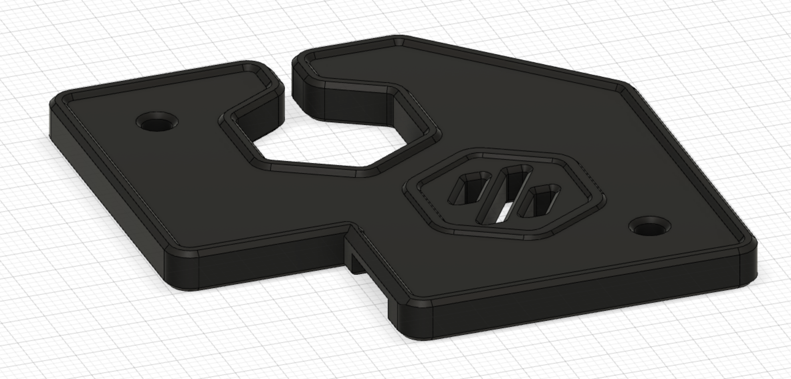
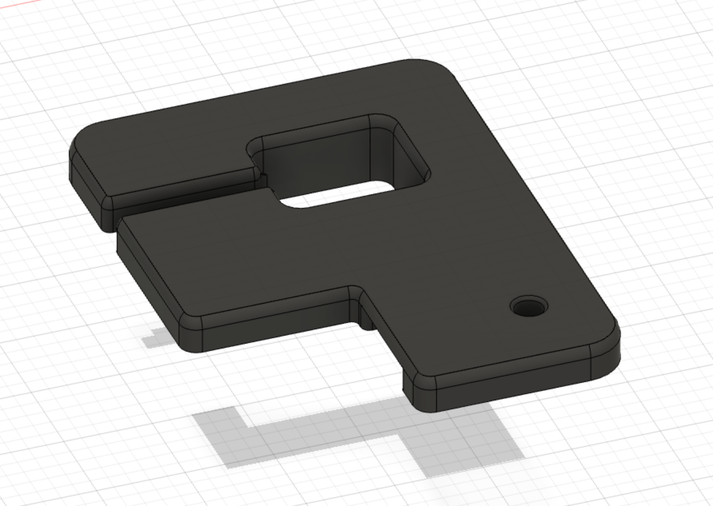
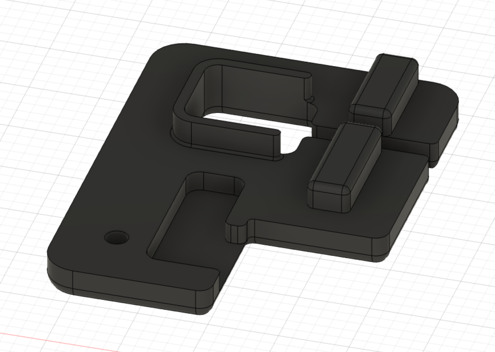

# z belt cover mod
## Credit
Mod based on the design of the Voron crew.
Thank you for your awesome work!
## Print settings
As stated in the Voron documentation:
* ABS
* 0.2mm layer hight
* 0.4mm extrusion width
* 40% infill
* wall count 4
* top/bottom layers 5
* no supports

## Bom
Only the printed file
## Improvement
Added the possibility to route cables on the bottom of the cover
## Description
I liked the design of the old Voron 2.2 covers more than the current design so I based my mod on them. But due to several requests I also included the current 2.4 covers.

To be able to achieve a clutter-free look i hid cables in the extrusions as much as possible.
So i also wanted to have a hidden way to route the cables to the bottom compartment. To achieve that i made
the z belt cover a bit thicker and cut a path on the bottom where cables can be routed without being seen.

The files are named with v22 in the filename for the 2.2 version and v24 in the filename for the 2.4 version.
## Pictures
2.2 version - top

&nbsp; 
2.2 vesrion - bottom with path for routing cables

2.4 version - top

&nbsp; 
2.4 vesrion - bottom with path for routing cables

